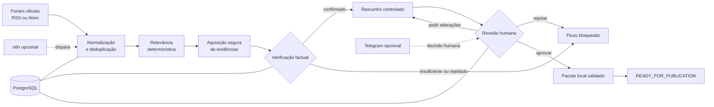

# AndréStudio Editorial Engine

Backend modular para automação editorial com verificação factual, geração
controlada de rascunhos, revisão humana e trilha de auditoria.

O projeto explora um problema comum em operações de conteúdo: reduzir o trabalho
manual de acompanhar fontes oficiais e preparar publicações sem delegar à IA a
decisão sobre o que é verdadeiro ou o ato de publicar. O resultado é um fluxo
local, testável e orientado a estados, com segurança e idempotência como
requisitos de domínio.

> **Escopo honesto:** este repositório não contém frontend, dashboard ou SaaS.
> Também não publica conteúdo automaticamente. As demonstrações principais são
> offline e usam fixtures; integrações externas são opcionais e permanecem
> bloqueadas por configuração.

## O que o projeto demonstra

- arquitetura de monólito modular com npm workspaces;
- domínio editorial modelado como máquina de estados;
- coleta e normalização de feeds RSS/Atom permitidos;
- deduplicação e política de relevância determinística e versionada;
- aquisição segura de evidências em páginas oficiais;
- verificação factual explicável antes da geração de texto;
- rascunhos vinculados a claims, evidências e citações;
- revisão humana com aprovação, rejeição e pedido de alterações;
- preservação de versões, eventos de auditoria e idempotência;
- adapters para PostgreSQL e canais externos sem acoplar o domínio;
- pacotes locais e planos `DRY_RUN` para publicação supervisionada.

## Fluxo editorial



`READY_FOR_PUBLICATION` significa que o material passou pelos controles locais.
Não significa autorização para deploy ou publicação em rede social. O código
preserva essa separação: publicação remota automática não foi implementada.

## Arquitetura

O sistema é um monólito modular. As regras ficam em pacotes independentes de
infraestrutura, e os adapters conectam banco, rede e canais externos apenas nas
bordas.

```text
apps/sistemandrestudio-api/   CLIs, demos e API HTTP interna
packages/content-engine/      máquina de estados e geração editorial
packages/sources/             feeds, normalização, allow-list e deduplicação
packages/evidence/            aquisição e extração segura de evidências
packages/application/         casos de uso e orquestração
packages/database/            adapters PostgreSQL e migrations
packages/shared/              contratos e utilitários compartilhados
automations/n8n/              workflows opcionais e inativos por padrão
```

Decisões principais:

- **monólito modular antes de microserviços:** reduz complexidade operacional sem
  misturar domínio e infraestrutura;
- **regras determinísticas antes da IA:** relevância e verificação não dependem
  da resposta de um modelo;
- **PostgreSQL como fonte de verdade:** decisões, versões e evidências possuem
  histórico persistente nos fluxos que usam o adapter;
- **humano no loop:** aprovação editorial é uma etapa explícita e auditável;
- **integrações nas bordas:** n8n agenda e coordena, mas não concentra regras de
  negócio nem substitui o estado persistido.

Documentação técnica selecionada:

- [arquitetura](docs/ARCHITECTURE.md);
- [máquina de estados](docs/STATE-MACHINE.md);
- [modelo de dados](docs/DATA-MODEL.md);
- [segurança](docs/SECURITY.md);
- [fontes oficiais](docs/OFFICIAL-SOURCES.md);
- [verificação factual](docs/FACTUAL-VERIFICATION.md);
- [orquestração editorial](docs/EDITORIAL-ORCHESTRATION.md);
- [PostgreSQL](docs/POSTGRESQL.md).

## Stack real

| Tecnologia | Uso no projeto |
| --- | --- |
| Node.js `>=24` | runtime, test runner e servidor HTTP nativo |
| TypeScript `6.0.3` | domínio, aplicação, adapters e CLIs |
| PostgreSQL `17-alpine` | persistência, concorrência e auditoria |
| `pg` `8.22.0` | client PostgreSQL |
| Zod `4.4.3` | validação de contratos e saídas estruturadas |
| Cheerio `1.1.2` | extração estática de páginas oficiais |
| fast-xml-parser `5.10.1` | parsing de RSS/Atom |
| OpenAI SDK `7.4.0` | adapter opcional de geração editorial |
| Docker Compose | ambiente local de PostgreSQL e API interna |
| n8n | workflows opcionais, versionados e inativos |

## Estado verificável

| Área | O que existe | Limite atual |
| --- | --- | --- |
| Domínio editorial | máquina de estados, invariantes, replay e idempotência | validado por testes e demos offline |
| Fontes | RSS/Atom, allow-list, normalização e deduplicação | execução ao vivo depende de rede e fontes permitidas |
| Evidências | validação de HTTPS, DNS/IP, redirects, tipo e tamanho | demo padrão usa respostas simuladas |
| Verificação | claims, associação de evidência e resultados explicáveis | somente confirmação suficiente avança o fluxo |
| Rascunhos | geração determinística com citações | adapters de LLM não são necessários para a demo |
| Revisão humana | console e contratos de decisão/versionamento | Telegram real exige configuração externa |
| PostgreSQL | migrations, repositórios e testes de integração | suíte de integração exige banco local ativo |
| n8n | contratos e workflows de orquestração | workflows ficam inativos por padrão |
| Publicação | exportação local em Markdown e JSON, planejamento `DRY_RUN` e reconciliação | não há deploy nem postagem automática |
| IA externa/local | adapters para Ollama e OpenAI com guardas | chamadas reais não fazem parte da validação pública |

Na preparação desta versão, `npm test` concluiu **373 de 373 testes** sem
PostgreSQL ou credenciais externas. Typecheck e build também passaram.

## Segurança por design

- arquivos `.env*` reais, chaves privadas, logs e dados locais ficam fora do
  versionamento;
- o cliente de evidências aceita somente HTTPS e hosts oficiais permitidos;
- resolução DNS, IPs privados, redirects, content type, tempo e tamanho de
  resposta são validados antes do processamento;
- HTML externo é tratado como dado não confiável e não executa JavaScript;
- a API de orquestração usa bind local por padrão, autenticação bearer com
  comparação segura, escopos, rate limit e limites de payload/tempo;
- `DRY_RUN_ORCHESTRATION=true` e `PUBLICATION_ENABLED=false` são os guard rails
  esperados para fluxos supervisionados;
- `VERIFIED` autoriza apenas a próxima etapa editorial — nunca uma publicação;
- ações de Telegram, LLM, n8n e rede não são executadas pela demo offline.

## Executar localmente

Pré-requisitos:

- Node.js 24 ou superior;
- npm 11 ou compatível com o lockfile.

Instalação e validação principal:

```bash
npm ci
npm run typecheck
npm test
npm run build
```

Esses comandos não precisam de credenciais. A suíte principal também não exige
PostgreSQL.

## Demo offline

A demonstração mais completa percorre um cenário fictício e controlado, sem
rede, banco ou serviços externos:

```bash
npm run demo:editorial-orchestration
```

Outras demos úteis:

```bash
npm run demo:relevance
npm run demo:verification
npm run demo:evidence
npm run demo:draft
npm run demo:review
npm run demo:publication
npm run demo:publication-reconciliation
```

Elas permitem observar as decisões do domínio em etapas menores. Os dados são
fixtures e simulações explícitas; nenhuma saída representa uma publicação real.

## PostgreSQL opcional

Para exercitar persistência e testes de integração, prepare os arquivos locais
somente se ainda não existirem, preencha apenas credenciais locais e inicie o
serviço:

```bash
test -f .env.local || cp .env.example .env.local
test -f .env.test || cp .env.example .env.test
docker compose up -d postgres
npm run db:migrate
npm run test:integration
npm run test:application:integration
```

O PostgreSQL é opcional para a primeira demonstração do repositório. Não use
credenciais reais no arquivo de exemplo nem versione o `.env.local` criado.

## Integrações opcionais

- **Ollama:** existe um adapter restrito ao endpoint local esperado e coberto por
  testes de contrato. A demo não pressupõe modelo instalado.
- **OpenAI:** existe um provider com schema de saída, limite de chamadas e gate
  explícito de orçamento. Nenhuma chave é fornecida ou necessária.
- **Telegram:** o canal valida chat, usuário e assinatura de callback. Um bot
  real depende de credenciais privadas e homologação separada.
- **Hermes:** integração experimental/opcional para operação assistida por agente;
  não faz parte do caminho principal validado.
- **n8n:** os workflows são artefatos de integração e permanecem inativos; o
  domínio continua no código TypeScript.

Essas capacidades são apresentadas como adapters implementados, não como uma
operação externa ativa ou homologada de ponta a ponta.

## Testes

| Comando | Cobertura prática |
| --- | --- |
| `npm test` | domínio, segurança, contratos, API interna e demos auxiliares |
| `npm run test:application` | serviços de aplicação em memória |
| `npm run test:relevance` | política determinística de relevância |
| `npm run typecheck` | contratos TypeScript sem emissão |
| `npm run build` | compilação de produção |
| `npm run test:integration` | repositório PostgreSQL; requer banco local |
| `npm run test:application:integration` | casos de uso com PostgreSQL; requer banco local |

O workflow de CI público executa somente a trilha offline: instalação pelo
lockfile, typecheck, build e `npm test`.

## Limitações conhecidas

- não existe interface gráfica, autenticação de usuário final ou experiência
  SaaS;
- a ligação ao vivo de todos os adapters em um único fluxo não é anunciada como
  concluída;
- testes PostgreSQL não rodam sem o serviço local;
- Ollama, OpenAI, Telegram e n8n não foram tratados como integrações reais na
  validação pública;
- publicação remota, deploy e postagem em redes sociais não existem neste
  repositório;
- a documentação técnica histórica ainda está sendo consolidada em torno deste
  README principal.

## Roadmap

- executar a suíte PostgreSQL em ambiente efêmero e isolado na CI;
- adicionar lint e métricas de cobertura sem alterar as regras de domínio;
- consolidar documentação técnica e diagramas de casos de uso;
- homologar, separadamente e com credenciais privadas, cada adapter opcional;
- ampliar testes de contrato para falhas reais de feeds e provedores;
- documentar um cenário end-to-end persistente reproduzível.

## Autoria

Projeto autoral conduzido por **André Aparecido Rodrigues**. Ferramentas de IA
foram usadas como apoio ao desenvolvimento e à documentação; as decisões de
produto, validações e responsabilidade técnica permanecem com o autor.

Não foi identificada base de fork ou template de terceiros. As bibliotecas npm
mantêm suas próprias licenças e avisos no lockfile.

## Licença

Uma licença para redistribuição ainda não foi definida. Antes da publicação, o
autor deve escolher conscientemente os termos aplicáveis; nenhuma licença foi
adicionada automaticamente nesta preparação.
