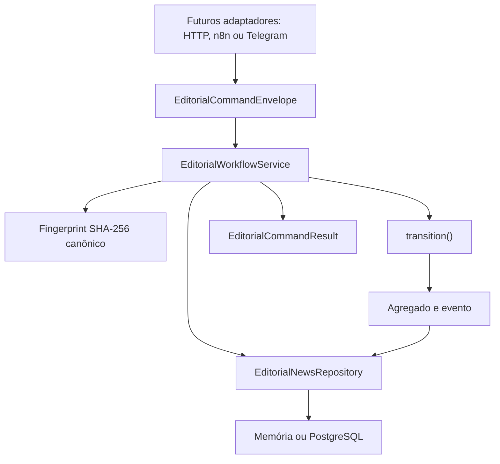

# Serviço de aplicação editorial — sistemandrestudio

## VerificationWorkflowService

O serviço recebe IDs, ator, horário, versão esperada, claims e evidências. Ele
calcula o resultado puro, cria fingerprint canônico e entrega uma única
operação à porta `VerificationUnitOfWork`. Não importa `pg`, SQL, Docker, HTTP
ou variáveis de ambiente. A resposta expõe estados, status, decisão, confiança,
claims, warnings, bloqueios e replay.

## Responsabilidade

`EditorialWorkflowService` é a camada de coordenação entre futuros adaptadores
de entrada e o núcleo editorial. Ele valida o envelope, consulta idempotência,
carrega o agregado, chama a função pura `transition()`, persiste com a versão
esperada e devolve um resultado independente de infraestrutura.

O serviço não implementa regras de transição, não conhece HTTP, n8n, Telegram,
PostgreSQL, SQL ou variáveis de ambiente.

Para relevância, `executeRelevanceWorkflow()` calcula a política pura e chama o
mesmo serviço duas vezes: `ScoreNews` e depois `RequestVerification` ou
`DiscardLowRelevance`. IDs, chaves, atores e horários dos dois comandos são
obrigatórios e explícitos. A coordenação não muda a autoridade da máquina.



## Limites

| Camada | Responsabilidade |
| --- | --- |
| Domínio | estados, invariantes, decisões, versões e eventos |
| Aplicação | ordem do caso de uso, envelope, idempotência e concorrência |
| Infraestrutura | transações, SQL, constraints e recuperação |
| Adaptadores futuros | converter HTTP, workflow ou callback em envelope |

A aplicação depende dos contratos do domínio. O PostgreSQL implementa esses
contratos. Não há dependência da aplicação para infraestrutura específica.

## Envelope

```ts
type EditorialCommandEnvelope = {
  commandId: string;
  idempotencyKey: string;
  newsId: string;
  command: EditorialWorkflowCommand;
  actor: Actor;
  occurredAt: string;
  expectedVersion?: number;
  reason?: string;
};
```

`commandId` também é o identificador determinístico do evento de domínio. Todos
os IDs internos necessários a um comando, como versão, solicitação e decisão,
fazem parte do próprio comando. Datas, atores e chaves nunca são gerados
silenciosamente.

`ReceiveNews` é o único comando exclusivo da aplicação. Ele cria o agregado
`RECEIVED` por meio de `createReceivedNews()` e impede uma segunda forma
concorrente de inicialização.

O envelope rejeita textos obrigatórios vazios, data fora do formato ISO UTC,
ator desconhecido, versão negativa, divergência entre metadados do envelope e
do comando e tipo não suportado.

## Fluxo

Para criação:

1. validar o envelope;
2. calcular o fingerprint;
3. procurar a chave idempotente;
4. confirmar que a notícia não existe;
5. criar `RECEIVED`;
6. registrar o comando processado;
7. persistir com versão zero.

Para transições:

1. validar o envelope;
2. procurar a chave idempotente;
3. carregar a notícia;
4. comparar `expectedVersion` com o número de eventos;
5. chamar `transition()`;
6. persistir o agregado atomicamente;
7. devolver o resultado estruturado.

O serviço não faz retry automático. Um chamador futuro decide se deve recarregar
o agregado e apresentar uma nova ação.

## Fingerprint e idempotência

`Sha256CommandFingerprint` usa `node:crypto` e JSON canônico com chaves
recursivamente ordenadas. Arrays preservam a ordem.

Participam do hash:

- `newsId`;
- ator e tipo do ator;
- `occurredAt`;
- tipo e payload funcional completo do comando;
- motivo resolvido.

Não participam:

- `commandId`, pois identifica a tentativa/evento;
- `idempotencyKey`, pois é a chave de consulta;
- configurações, connection strings ou credenciais.

Os payloads são projetados explicitamente por tipo de comando; campos futuros
não entram silenciosamente no hash. A mesma chave e fingerprint devolvem replay
sem transição, gravação ou novo evento. Tipo, notícia ou conteúdo diferente
produz `IDEMPOTENCY_CONFLICT`.

O repositório expõe `findProcessedCommand()`. Na memória, a consulta percorre
snapshots isolados; no PostgreSQL, usa `processed_commands`. Assim a garantia
persiste após nova instância ou conexão.

## Concorrência

A versão do agregado é o total de eventos persistidos. O serviço compara a
versão declarada antes da transição e passa a mesma versão ao `save()`. O
adaptador PostgreSQL confirma novamente por `lock_version` dentro da transação.

Se outro comando vencer a disputa, o segundo recebe `CONCURRENCY_CONFLICT`.
Nenhuma versão, decisão, solicitação ou evento parcial permanece.

## Resultado

```ts
type EditorialCommandResult = {
  commandId: string;
  idempotencyKey: string;
  news: EditorialNews;
  previousState: EditorialState | null;
  newState: EditorialState;
  events: readonly AuditEvent[];
  currentVersion: number;
  currentDraftVersionId: string | null;
  replayed: boolean;
};
```

`events` contém somente eventos produzidos nesta execução. Em replay, é vazio.
Estado e versão do resultado original são recuperados do registro persistido.
Nenhum tipo de `pg` aparece no resultado.

## Erros

| Código | Situação |
| --- | --- |
| `INVALID_COMMAND_ENVELOPE` | metadado obrigatório ausente ou inválido |
| `EDITORIAL_NEWS_NOT_FOUND` | transição solicitada para notícia inexistente |
| `EDITORIAL_NEWS_ALREADY_EXISTS` | segunda tentativa conflitante de criação |
| `IDEMPOTENCY_CONFLICT` | chave associada a conteúdo diferente |
| `CONCURRENCY_CONFLICT` | versão esperada desatualizada |
| `COMMAND_PERSISTENCE_FAILED` | falha não classificada do repositório |
| `UNSUPPORTED_COMMAND` | tipo fora da lista permitida |

Erros editoriais, como `INVALID_TRANSITION`, continuam vindo do domínio. O erro
de persistência mantém a causa para diagnóstico interno, mas mensagens e
detalhes públicos não incluem credenciais ou connection strings.

## Testes e exemplos

```bash
npm run test:application
npm run test:application:integration
npm run demo:application
npm run demo:application:postgres
```

Os testes unitários usam somente memória, IDs e horários fixos. Os testes de
integração usam apenas `sistemandrestudio_test`, com migrations e reset
protegido pelo sufixo `_test`.

A demo PostgreSQL fecha a primeira pool, abre uma segunda, repete o último
comando e confirma replay sem novo evento.

## Uso futuro

- Uma API validará autenticação e converterá o corpo aceito no envelope.
- O n8n fornecerá IDs, chave, versão e payload; não decidirá transições.
- O Telegram converterá uma ação humana autenticada em comando de aprovação,
  rejeição ou alteração.

Esses adaptadores devem depender do serviço, sem acessar diretamente a máquina
ou o banco. Nenhum deles foi implementado nesta etapa.

## Relevância determinística

O serviço recebe um `RelevanceInput` e uma `RelevancePolicy`; não escolhe
silenciosamente a versão. O resultado completo participa do fingerprint
canônico de `ScoreNews`, portanto reutilizar a chave com breakdown, penalidade
ou política diferente produz conflito idempotente.

Uma falha no comando de roteamento deixa o agregado recuperável em `SCORED`;
não existe uma transação distribuída entre dois comandos. Cada comando
individual continua atômico. Consulte
[`RELEVANCE-POLICY.md`](RELEVANCE-POLICY.md).

## Limitações

- a versão é derivada da quantidade de eventos, adequada ao agregado atual;
- não há autorização de usuário ou política de permissões;
- não há schema externo para transporte;
- não há logs, métricas, timeout, retry ou fila;
- `ReceiveNews` não produz evento editorial, mas registra idempotência;
- não há HTTP ou integração externa;
- o MVP não está concluído.
# Serviço de rascunho editorial

`EditorialDraftWorkflowService.createDraft` prepara o pacote e a geração fora
da transação. `PostgresEditorialDraftRepository` bloqueia a notícia, confere
versão esperada e estado, grava dados e transições atomicamente. Replay usa a
chave idempotente; chave incompatível e concorrência retornam erros estáveis.
