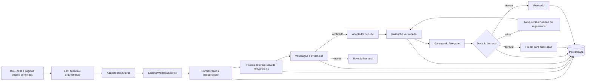

# Arquitetura — sistemandrestudio

## Fronteira de verificação factual

`VerificationWorkflowService` depende somente de uma porta de unidade de
trabalho. A política pura pertence ao `content-engine`; o adaptador PostgreSQL
implementa a porta e coordena a verificação com o agregado editorial na mesma
transação. Essa fronteira evita SQL na aplicação e persistência parcial.

## 1. Objetivo arquitetural

O primeiro MVP deve validar uma única trilha editorial auditável:

> coletar → deduplicar → classificar → verificar → gerar → aprovar → armazenar

A arquitetura favorece operação local, baixo custo e substituição de
fornecedores. Ela não tenta antecipar publicação, CRM, painel completo ou uma
rede de agentes.

## 2. Decisões recomendadas

| Tecnologia | Decisão para o MVP | Justificativa |
| --- | --- | --- |
| Node.js + TypeScript | Adotar | Alinhado ao conhecimento existente e adequado para API, workers e integrações |
| PostgreSQL | Implementado localmente | Transações, constraints, idempotência e auditoria no mesmo banco |
| n8n | Adotar de forma limitada | Bom para agenda, retries e fluxo previsível; não será fonte de verdade |
| Telegram Bot | Adotar quando autorizado | Interface remota simples para aprovação humana |
| Docker Compose | Implementado para PostgreSQL | Reprodutibilidade com um único container local |
| API de LLM | Usar por adaptador | Permite trocar modelo/provedor e limitar custos |
| Redis | Não usar inicialmente | PostgreSQL e jobs simples bastam até haver evidência de contenção ou fila |
| Hermes Agent | Adiar para a fase 2 | O fluxo inicial é previsível e não exige supervisor autônomo |
| React/Next.js | Adiar | Painel web não é necessário para provar o fluxo editorial |
| Ollama | Avaliar futuramente | Exige capacidade local e manutenção; não reduz toda a complexidade operacional |
| Postiz | Adiar | Publicação está fora do MVP e requer nova autorização |
| AWS EC2/S3 | Adiar | Desenvolvimento local deve preceder custo e superfície pública |
| Lead Flow Studio | Adiar | CRM não faz parte da fatia editorial inicial |

### Hermes Agent

A decisão é a **opção 2: avaliar Hermes Agent somente na segunda fase**. No MVP,
ele será substituído pela combinação mais simples de n8n, regras TypeScript e
aprovação humana.

O n8n consegue controlar o fluxo determinístico, e a aplicação TypeScript
concentra as regras testáveis. Introduzir um supervisor agora aumentaria
permissões, consumo de tokens, caminhos de falha e dificuldade de auditoria sem
resolver um problema comprovado.

Hermes pode ser reavaliado na fase 2 para tarefas que exijam planejamento
dinâmico entre domínios, recuperação de exceções não previstas ou coordenação de
ferramentas. Mesmo nessa fase, deverá operar com allowlist de ações, orçamento,
aprovação humana e escopo mínimo.

## 3. Visão dos componentes

O PostgreSQL é a fonte de verdade durante todo o processo. As setas para o banco
representam transações e eventos de auditoria; o n8n não mantém o único registro
do estado.

## 4. Responsabilidades

### 4.1 n8n

- disparar coletas por horário ou evento;
- chamar operações idempotentes da aplicação;
- aplicar timeout e retry limitado;
- encaminhar falhas para uma trilha de revisão;
- exportar workflows sem credenciais para versionamento.

Não deve conter regras editoriais complexas nem ser usado como banco de negócio.
Não será instalado globalmente.

### 4.2 Serviço de aplicação editorial

`EditorialWorkflowService` está implementado no pacote `application` e:

- valida o envelope recebido;
- consulta idempotência persistente;
- cria ou carrega o agregado;
- compara a versão esperada;
- chama `transition()`;
- persiste o resultado atomicamente;
- devolve um resultado sem tipos de infraestrutura.

Todos os IDs, atores e horários entram explicitamente. O fingerprint usa
SHA-256 nativo sobre uma representação canônica. O serviço não importa `pg`,
SQL, ambiente ou Docker. Consulte
[`APPLICATION-SERVICE.md`](APPLICATION-SERVICE.md).

### 4.3 Adaptadores futuros em `sistemandrestudio-api`

Um monólito modular Node.js/TypeScript deve conter:

- API interna;
- worker de ingestão;
- normalização e fingerprint;
- classificação de relevância;
- motor de verificação;
- adaptadores para fontes e LLM;
- gateway do Telegram;
- máquina de estados;
- auditoria e observabilidade.

Separar módulos dentro de um único processo reduz manutenção. Serviços poderão
ser extraídos apenas quando volume ou isolamento justificarem.

Hoje, somente a máquina editorial, o serviço de aplicação e demos locais
existem. A política de relevância pura também está implementada no domínio.
API, worker e adaptadores externos continuam descrições futuras.

### 4.4 Política determinística de relevância

`calculateRelevance(input, policy)` recebe datas, indicadores e tipos
explicitamente. A configuração versionada centraliza tópicos e aliases, seis
pesos que somam 100, penalidades e thresholds. O resultado explicável é
convertido em `ScoreNews`; o serviço executa o score e o roteamento, mas a
máquina mantém autoridade sobre as transições.

O resultado completo fica no JSONB de relevância e guarda a configuração
necessária para reproduzir a decisão. Consulte
[`RELEVANCE-POLICY.md`](RELEVANCE-POLICY.md).

### 4.5 PostgreSQL

- implementar `EditorialNewsRepository` no pacote de infraestrutura
  `packages/database`;
- armazenar dados estruturados;
- garantir unicidade e idempotência;
- registrar versões de conteúdo;
- registrar solicitações e ações de aprovação;
- manter auditoria append-only;
- proteger updates com `lock_version`;
- executar a gravação do agregado em uma transação.

O contrato de repositório pertence ao `content-engine` e retorna `Promise`. O
adaptador PostgreSQL depende do domínio; o domínio não importa `pg`, SQL,
variáveis de ambiente ou Docker. A implementação em memória continua disponível.
Detalhes estão em [`POSTGRESQL.md`](POSTGRESQL.md).

Redis só deverá ser introduzido com evidência de que locks, fila ou cache no
PostgreSQL não atendem ao volume.

### 4.6 Fontes

Cada adaptador deve coletar somente fontes aprovadas, preferindo RSS e APIs
oficiais. Scraping genérico não faz parte do MVP. Cada registro guarda URL,
horários de publicação, acontecimento e coleta, além de hash do conteúdo
utilizado.

### 4.7 Adaptador de LLM

O modelo recebe fatos e evidências selecionados, um template versionado e um
schema de saída. O adaptador registra modelo, parâmetros, tokens, custo estimado,
latência e hashes. O modelo não recebe credenciais, não publica e não escolhe
sozinho se a notícia é verdadeira.

### 4.8 Telegram

O Telegram é uma interface de comando, não a fonte de verdade. O bot envia:

- título e resumo;
- nível de confiança;
- fontes e datas;
- versão do rascunho;
- ações para aprovar, editar ou rejeitar.

Somente IDs explicitamente permitidos podem agir. Uma edição cria nova versão e
exige nova aprovação. Callbacks devem expirar, ser de uso único e idempotentes.
No desenvolvimento local, long polling evita endpoint público; webhook fica para
uma fase hospedada.

## 5. Fluxo completo

1. O n8n agenda uma coleta em uma fonte ativa.
2. O adaptador recebe o item e preserva seus metadados.
3. A aplicação normaliza URL, título, datas e identificador da fonte.
4. Um fingerprint detecta duplicidade exata ou provável.
5. Itens inéditos recebem pontuação de relevância por regras versionadas.
6. Itens relevantes seguem para verificação; os demais ficam registrados.
7. A verificação procura evidências oficiais ou independentes, compara datas e
   separa fato, interpretação, rumor e opinião.
8. O resultado recebe nível de confiança e justificativa.
9. Apenas itens verificados geram rascunho automaticamente.
10. O rascunho mantém créditos e links, sem copiar o conteúdo integral.
11. O Telegram envia a solicitação de aprovação ao usuário autorizado.
12. Aprovação, edição ou rejeição gera uma ação imutável no banco.
13. O conteúdo aprovado passa a `READY_FOR_PUBLICATION`; nenhuma publicação é
    executada pelo MVP.

## 6. Deduplicação

Camadas sugeridas:

1. chave única por fonte e identificador original;
2. URL canônica sem parâmetros de rastreamento;
3. hash do título e do conteúdo normalizados;
4. similaridade de título para candidatos próximos;
5. vínculo explícito entre duplicata e item canônico;
6. revisão humana quando a similaridade não for conclusiva.

O processo deve preferir registrar a relação de duplicidade a apagar itens.

## 7. Verificação e regras editoriais

A verificação combina regras determinísticas e revisão humana:

- nunca inventar ou completar informações ausentes;
- priorizar fontes oficiais;
- exigir corroboração quando a afirmação for sensível;
- guardar URL e data de cada evidência;
- comparar data de publicação com data do acontecimento;
- bloquear conteúdo antigo apresentado como atual;
- sinalizar títulos sensacionalistas;
- distinguir fato, interpretação, rumor e opinião;
- calcular confiança a partir de critérios registrados;
- produzir análise original, sem copiar integralmente conteúdo de terceiros;
- manter crédito e link para cada fonte utilizada;
- registrar pessoa, data e versão aprovada;
- encaminhar divergência ou baixa confiança para revisão;
- nunca usar o LLM como única fonte factual.

“Verificado” significa que a política operacional versionada foi satisfeita, não
uma garantia absoluta de verdade.

## 8. Logs e observabilidade

Logs devem ser estruturados em JSON e conter:

- timestamp;
- nível;
- `correlation_id`;
- componente e operação;
- resultado, duração e número da tentativa;
- códigos de erro sanitizados.

Tokens, headers, corpo integral de notícias, dados pessoais desnecessários e
prompts sensíveis não devem aparecer nos logs. Métricas iniciais: volume
coletado, duplicatas, resultados de verificação, tempo por etapa, retries, taxa
de aprovação e custo do LLM.

## 9. Auditoria

`audit_logs` deve ser append-only. Cada evento registra ator, origem, ação,
entidade, estado anterior, estado posterior, horário, `correlation_id` e
metadados seguros. Alterações de política, fontes e configurações também geram
auditoria.

Logs operacionais podem expirar rapidamente; registros de auditoria seguem uma
retenção maior, definida pelo proprietário.

## 10. Segurança

As fronteiras principais são:

- fonte externa → ingestão;
- n8n → API interna;
- LLM → saída estruturada;
- Telegram → ação autenticada;
- aplicação → PostgreSQL.

Todo conteúdo externo é dado não confiável. Nenhum texto coletado pode gerar
comandos, chamadas de ferramenta ou mudanças de configuração. Detalhes estão em
[`SECURITY.md`](SECURITY.md).

## 11. Portas planejadas

| Porta | Uso | Situação |
| ---: | --- | --- |
| 3000 | API local | futura |
| 3001 | painel web | futura |
| 55432 | PostgreSQL | local, bind em `127.0.0.1` |
| 5678 | n8n | futura |
| 6379 | Redis | reservada, não necessária agora |
| 11434 | Ollama | futura |

A porta 5432 estava ocupada por outro container no momento da implementação, por
isso este projeto adotou 55432 como padrão configurável. Em hospedagem, banco,
n8n e serviços internos não devem ser expostos diretamente à internet.

## 12. Evolução

1. fluxo local com fixtures — concluído;
2. PostgreSQL local — concluído;
3. camada de serviço de aplicação sem HTTP — concluída;
4. política determinística de relevância com fixtures — concluída;
5. política determinística de verificação com evidências fictícias;
6. n8n local, somente quando autorizado;
7. uma fonte real, um LLM e Telegram, conectados separadamente;
8. operação hospedada e endurecimento;
9. painel web e calendário editorial;
10. publicação autorizada;
11. integração com Lead Flow Studio;
12. avaliação de Hermes e agentes especializados;
13. empacotamento multiempresa, com isolamento de tenants.

## Aquisição de evidências oficiais

`OfficialEvidenceAcquisitionService` recebe somente `radarItemId`. O pacote
`evidence` resolve a política da fonte, faz HTTP e parsing fora da transação e
entrega candidatos determinísticos. O adaptador PostgreSQL valida a versão e
persiste aquisição, verificação e transição editorial em uma única transação.
O domínio não conhece HTML, Cheerio, HTTP ou SQL. Veja
[`OFFICIAL-EVIDENCE-ACQUISITION.md`](OFFICIAL-EVIDENCE-ACQUISITION.md).
# Etapa 10 — rascunho controlado

Após a verificação factual, `EditorialDraftWorkflowService` constrói um
`EditorialBrief` puro e envia-o ao gerador determinístico. O adaptador
PostgreSQL revalida o estado `VERIFIED` sob lock, persiste brief/draft/citações
e aplica `CreateDraft` + `SubmitForApproval` em uma única transação. Uma futura
porta de LLM fica atrás de `EditorialTextGenerator`; nenhum provedor é conectado.

O comando operacional 10.1 compõe radar, relevância, aquisição oficial,
verificação e drafting sem criar uma nova camada autônoma. O diagnóstico é
somente leitura; o limite é dez itens e a identidade lógica é versionada. A
persistência editorial permanece uma transação curta depois da rede.
## Aprovação local

Aplicação → porta de revisão → adaptador PostgreSQL transacional. O adaptador concentra locks, persistência, replay e auditoria; não há publicação ou integração externa nesta fronteira.

## Pacotes de publicação

O serviço determinístico monta o pacote, o exportador local controla paths e escrita atômica, e o adaptador PostgreSQL persiste manifesto, hashes e auditoria antes de marcar o agregado como pronto.

## Plano de website

Aplicação → leitor local validado → porta de planos → PostgreSQL. Essa fronteira
somente descreve uma execução futura. O modo `DRY_RUN` bloqueia operações
remotas; plataforma, build, deploy, restart e rollback não são inferidos.

O target é versionado separadamente da política. A versão v2 troca o domínio
canônico para `andrestudio.dev.br` e representa estratégia, diretórios, rota e
build como `UNKNOWN`; planos v1 com DuckDNS permanecem históricos.

## Reconciliação pública

Aplicação → leitor do pacote local → cliente HTTP público seguro → política de
verificação → porta de reconciliação → PostgreSQL. Rede ocorre antes da
transação; somente checks e fingerprints limitados entram no banco. O adaptador
revalida pacote, draft, aprovação e estado sob lock e grava reconciliação,
verificação, checks, auditoria e `PUBLISHED` atomicamente.

Essa fronteira observa um deploy externo já feito. Não contém porta de deploy,
SSH, upload, DNS, Nginx ou restart. A origem manual é parte obrigatória da
identidade e da auditoria.
## Orquestração editorial supervisionada

`EditorialOrchestrationService` ocupa a camada de aplicação. Ele coordena portas
dos serviços existentes, persiste checkpoints via
`EditorialOrchestrationRepository` e interrompe em
`WAITING_HUMAN_DECISION`. n8n permanece fora do domínio e PostgreSQL permanece
como fonte de verdade. Transporte Telegram implementa `HumanDecisionChannel`;
decisões usam um executor adaptador do `HumanEditorialReviewService`.

A API interna nativa Node é restrita a localhost, autenticada e sem endpoints
de deploy. Consulte [EDITORIAL-ORCHESTRATION.md](EDITORIAL-ORCHESTRATION.md).
