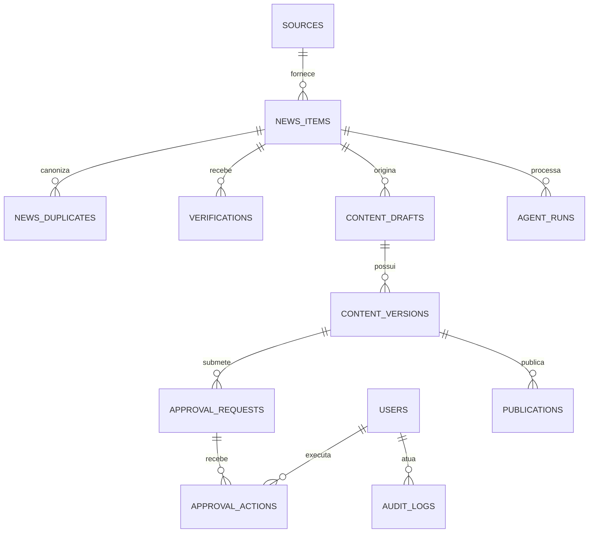

# Modelo de dados — sistemandrestudio

## Verificação factual

`verification_runs` identifica política, versão, fingerprint, versão esperada e
estados anterior/final. Claims e evidências preservam ordem por execução;
resultados geral e por claim guardam a explicação completa. Foreign keys,
checks de status/decisão/confiança, limites e unicidade sustentam o modelo. A
migration 005 complementa a 004 sem reescrever seu checksum já aplicado.

## 1. Status

O schema mínimo do agregado editorial foi implementado localmente. As entidades
amplas descritas nas seções seguintes continuam sendo proposta futura; campos,
retenção e dados pessoais ainda precisam de aprovação antes de dados reais.

O PostgreSQL será a fonte de verdade. IDs podem usar UUID; datas devem ser
armazenadas em UTC; entidades mutáveis devem ter `created_at`, `updated_at` e
controle de versão. Tokens e chaves nunca pertencem a essas tabelas.

## Modelo físico implementado

| Tabela | Conteúdo atual |
| --- | --- |
| `editorial_news` | estado, fonte, título, URLs, relevância, verificação, ponteiros atuais e `lock_version` |
| `editorial_relevance_results` | resultado explicável da política em JSONB, um por notícia |
| `draft_versions` | corpo e metadados das versões imutáveis |
| `approval_requests` | submissão e estado de uma versão |
| `approval_actions` | decisão humana com chave idempotente |
| `audit_events` | transições append-only |
| `processed_commands` | fingerprints e resultados idempotentes |
| `schema_migrations` | migrations e checksums aplicados |

O modelo foi ajustado ao agregado TypeScript existente. `approval_requests` é
necessária porque cada decisão resolve uma solicitação específica. A relação
futura entre `content_drafts` e `content_versions` foi reduzida a
`draft_versions`, pois o agregado possui um único conjunto versionado por
notícia. `base_content` permanece igual ao título normalizado até o domínio
receber um campo próprio.

`editorial_relevance_results.result` preserva o resultado explicável completo:
score, breakdown, penalidades, tópicos, fatores, prioridade, decisão, política,
pesos, thresholds e data de avaliação. JSONB foi escolhido porque critérios e
explicações evoluem por versão; `editorial_news.relevance_score` permanece
escalar e `editorial_news.relevance` mantém somente o resumo compatível. A
migration `002` cria a tabela, faz backfill explícito de resultados legados e
adiciona índice por política/versão.

As foreign keys usam `ON DELETE RESTRICT`; versões são únicas por notícia e
número; chaves idempotentes são únicas; e uma constraint diferida impede
`READY_FOR_PUBLICATION` sem aprovação persistida da versão atual. O SQL completo
está em `packages/database/migrations`; a operação está documentada em
[`POSTGRESQL.md`](POSTGRESQL.md).

## 2. Relações

O diagrama abaixo representa a visão futura, não as tabelas já criadas.

## 3. Entidades

### 3.1 `sources`

- **Finalidade:** catálogo das fontes e sua política de confiança.
- **Campos principais:** `id`, `name`, `type`, `base_url`, `feed_url`,
  `is_official`, `trust_tier`, `language`, `active`, `last_collected_at`,
  `policy_version`.
- **Relacionamentos:** possui muitos `news_items`.
- **Dados sensíveis:** URLs públicas não são sensíveis; credenciais da fonte
  ficam fora da tabela, referenciadas por identificador de secret.
- **Retenção proposta:** enquanto ativa e por 24 meses após desativação.

### 3.2 `news_items`

- **Finalidade:** item normalizado e seu estado editorial.
- **Campos principais:** `id`, `source_id`, `external_id`, `canonical_url`,
  `title`, `summary`, `published_at`, `event_at`, `collected_at`,
  `content_hash`, `relevance_score`, `relevance_reason`, `status`,
  `correlation_id`.
- **Relacionamentos:** pertence a `sources`; possui duplicatas, verificações e
  rascunhos.
- **Dados sensíveis:** pode conter nomes ou informações pessoais presentes na
  notícia; evitar guardar o artigo integral.
- **Retenção proposta:** 12 a 24 meses, revisável por finalidade editorial.

### 3.3 `news_duplicates`

- **Finalidade:** preservar a relação entre item duplicado e item canônico.
- **Campos principais:** `id`, `canonical_news_item_id`,
  `duplicate_news_item_id`, `match_type`, `similarity_score`, `matched_at`,
  `policy_version`.
- **Relacionamentos:** referencia dois `news_items`.
- **Dados sensíveis:** nenhum adicional.
- **Retenção proposta:** igual à dos itens relacionados.

### 3.4 `verifications`

- **Finalidade:** registrar cada tentativa e conclusão da verificação.
- **Campos principais:** `id`, `news_item_id`, `status`, `confidence_level`,
  `claim_type`, `evidence` em JSON estruturado, `conflicts`, `verified_at`,
  `policy_version`, `reviewer_user_id`.
- **Relacionamentos:** pertence a `news_items`; pode referenciar `users`.
- **Dados sensíveis:** trechos mínimos de evidência e possíveis dados pessoais.
- **Retenção proposta:** 24 meses para sustentar auditoria editorial.

Cada evidência deve conter URL, fonte, data de publicação, data do acontecimento,
horário de coleta, hash e papel (`supports`, `contradicts` ou `context`).

### 3.5 `content_drafts`

- **Finalidade:** agrupar o rascunho gerado para uma notícia.
- **Campos principais:** `id`, `news_item_id`, `format`, `audience`, `status`,
  `current_version_id`, `created_at`.
- **Relacionamentos:** pertence a `news_items`; possui `content_versions`.
- **Dados sensíveis:** conteúdo editorial ainda não aprovado.
- **Retenção proposta:** 24 meses ou conforme política editorial.

### 3.6 `content_versions`

- **Finalidade:** manter histórico imutável de geração e edição.
- **Campos principais:** `id`, `content_draft_id`, `version_number`, `body`,
  `source_links`, `created_by_type`, `created_by_user_id`, `model_provider`,
  `model_id`, `prompt_version`, `input_hash`, `output_hash`, `token_usage`,
  `estimated_cost`, `created_at`.
- **Relacionamentos:** pertence a `content_drafts`; possui solicitações de
  aprovação.
- **Dados sensíveis:** texto editorial e metadados de custo; nunca guardar chave
  ou prompt com segredo.
- **Retenção proposta:** 24 meses; versões aprovadas podem seguir retenção maior.

### 3.7 `approval_requests`

- **Finalidade:** submissão de uma versão específica à aprovação.
- **Campos principais:** `id`, `content_version_id`, `channel`, `status`,
  `telegram_message_id`, `expires_at`, `nonce_hash`, `requested_at`,
  `resolved_at`.
- **Relacionamentos:** pertence a `content_versions`; possui
  `approval_actions`.
- **Dados sensíveis:** IDs do Telegram são identificadores pessoais/pseudônimos;
  nonce deve ser armazenado como hash.
- **Retenção proposta:** 12 a 24 meses.

### 3.8 `approval_actions`

- **Finalidade:** registrar aprovação, edição, rejeição ou expiração.
- **Campos principais:** `id`, `approval_request_id`, `user_id`, `action`,
  `reason`, `resulting_version_id`, `channel_event_id`, `acted_at`,
  `idempotency_key`.
- **Relacionamentos:** pertence a `approval_requests` e `users`; pode gerar nova
  `content_version`.
- **Dados sensíveis:** identidade do aprovador e texto livre do motivo.
- **Retenção proposta:** pelo menos 24 meses para auditoria.

### 3.9 `publications`

- **Finalidade:** registrar tentativas futuras de publicação.
- **Campos principais:** `id`, `content_version_id`, `destination`, `status`,
  `external_publication_id`, `scheduled_at`, `published_at`, `error_code`.
- **Relacionamentos:** pertence à versão explicitamente aprovada.
- **Dados sensíveis:** IDs externos; credenciais permanecem fora.
- **Retenção proposta:** metadados enquanto a publicação existir e por prazo
  adicional definido.

Esta tabela é **adiada**. O MVP termina em `READY_FOR_PUBLICATION`.

### 3.10 `agent_runs`

- **Finalidade:** registrar futuras execuções de Hermes ou agentes
  especializados.
- **Campos principais:** `id`, `agent_type`, `objective`, `status`,
  `news_item_id`, `started_at`, `finished_at`, `model_id`, `token_usage`,
  `estimated_cost`, `input_hash`, `output_hash`, `error_code`.
- **Relacionamentos:** opcionalmente ligado a `news_items` ou outras entidades.
- **Dados sensíveis:** objetivos e resumos podem conter dados operacionais;
  evitar armazenar raciocínio interno ou segredos.
- **Retenção proposta:** payload por 90 dias e metadados agregados por 12 meses.

Esta tabela é **adiada** junto com o Hermes.

### 3.11 `audit_logs`

- **Finalidade:** trilha append-only de ações e transições.
- **Campos principais:** `id`, `actor_type`, `actor_id`, `action`,
  `entity_type`, `entity_id`, `previous_state`, `next_state`,
  `correlation_id`, `metadata`, `occurred_at`.
- **Relacionamentos:** referência lógica a qualquer entidade e opcionalmente a
  `users`.
- **Dados sensíveis:** pode revelar comportamento operacional; metadata deve ser
  sanitizado.
- **Retenção proposta:** 24 meses, sujeita a requisitos legais e de custo.

### 3.12 `users`

- **Finalidade:** identidades humanas autorizadas.
- **Campos principais:** `id`, `display_name`, `role`, `status`,
  `telegram_user_id`, `created_at`, `disabled_at`.
- **Relacionamentos:** aprovações, revisões e auditoria.
- **Dados sensíveis:** nome e identificador do Telegram; aplicar acesso mínimo.
- **Retenção proposta:** durante o vínculo e por 12 meses após desativação,
  preservando referências auditáveis por pseudonimização quando possível.

### 3.13 `system_settings`

- **Finalidade:** configurações não secretas, versionadas e auditáveis.
- **Campos principais:** `key`, `value_json`, `environment`, `version`,
  `updated_by_user_id`, `updated_at`.
- **Relacionamentos:** pode referenciar o usuário que alterou.
- **Dados sensíveis:** nenhum segredo é permitido; somente identificadores de
  secret.
- **Retenção proposta:** valor atual e histórico por 24 meses.

## 4. Restrições e índices

- unicidade de `sources.feed_url` quando aplicável;
- unicidade de `news_items(source_id, external_id)`;
- unicidade de `news_items.content_hash` quando a política permitir;
- unicidade de versão por `content_draft_id, version_number`;
- unicidade de `approval_actions.idempotency_key`;
- unicidade de evento externo por canal;
- índices por status e horário para workers;
- foreign keys sem cascade destrutivo em registros auditáveis;
- `correlation_id` indexado em todas as entidades operacionais;
- check constraints para estados e níveis de confiança.

## 5. Corte futuro do MVP

Depois do agregado mínimo já persistido, avaliar somente quando cada capacidade
for autorizada:

- `sources`;
- `news_items`;
- `news_duplicates`;
- `verifications`;
- `content_drafts`;
- `content_versions`;
- `approval_requests`;
- `approval_actions`;
- `audit_logs`;
- `users`;
- configurações mínimas não secretas.

Adiar `publications` e `agent_runs`. A tabela `system_settings` pode começar como
configuração validada em arquivo se isso reduzir complexidade, desde que não
contenha segredos.

## 6. Retenção e LGPD

Os prazos acima são hipóteses, não decisões finais. Antes de dados reais:

1. definir finalidade de cada campo;
2. confirmar base legal e necessidade;
3. reduzir texto integral e dados pessoais;
4. definir exclusão, anonimização e backup;
5. limitar quem pode consultar exportações;
6. documentar exceções para auditoria.
# Modelo de dados

Além das entidades editoriais, a migração incremental `003_official_source_radar.sql` adiciona `source_definitions`, `source_fetch_runs`, `collected_source_items` e `source_item_duplicates`. Esses registros separam a evidência da coleta da decisão editorial, preservando URL canônica, hash, origem, execução e duplicidade sem guardar respostas brutas do feed.

## Aquisição de páginas oficiais

A migration incremental `006_official_evidence_acquisition.sql` adiciona runs
de aquisição/fetch, snapshots mínimos, metadados selecionados e candidatos de
evidência. HTML completo não é armazenado. Hashes e versões de política
distinguem replay de conteúdo alterado; foreign keys ligam item, notícia, claim,
evidência e página, preservando o histórico.
## Revisão editorial

`editorial_review_decisions` registra decisão, revisor, versões, política, comando e fingerprint. `editorial_revision_requests` liga instruções à versão de origem e à versão revisada. Drafts revisados são imutáveis e encadeados por `source_draft_id`.
