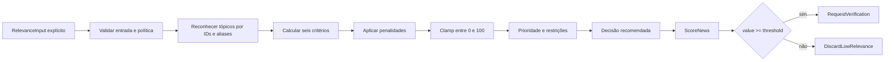

# Política determinística de relevância — sistemandrestudio

## Objetivo

A política calcula, sem rede ou inteligência artificial, quanto uma notícia
fictícia se relaciona ao posicionamento da AndreStudio.dev. O resultado é
explicável, reproduzível e adequado para auditoria: contém pontuação,
breakdown, códigos de razão, penalidades, prioridade, decisão recomendada,
identidade da política e configuração efetivamente usada.

`calculateRelevance(input, policy)` é pura. A função recebe todas as datas,
não consulta relógio, banco, ambiente ou estado global e não gera IDs.



O `FAST_TRACK` acelera a entrada na verificação; nunca pula a verificação
factual.

## Política versionada

| Campo | Valor atual |
| --- | --- |
| ID | `andre-studio-relevance` |
| Versão | `andre-studio-relevance-v1` |
| Soma dos pesos | 100 |
| Limiar editorial | 50 |

Tópicos, aliases, pesos, scores de fonte e novidade, penalidades e thresholds
ficam centralizados em `relevance-policy.ts`. Alterar qualquer comportamento
exige uma nova versão; resultados antigos guardam a versão, pesos e thresholds
usados.

## Critérios e pesos

| Código estável | Máximo | Regra inicial |
| --- | ---: | --- |
| `TOPIC_AFFINITY` | 30 | até 10 pontos por tópico reconhecido |
| `SOURCE_AUTHORITY` | 15 | score configurado pelo tipo informado |
| `FRESHNESS` | 20 | idade do acontecimento na data de avaliação |
| `TECHNICAL_IMPACT` | 15 | tipo explícito de novidade |
| `COMMERCIAL_POTENTIAL` | 10 | relações comerciais informadas |
| `CONTENT_POTENTIAL` | 10 | formatos de conteúdo possíveis |

Os tipos de fonte são `OFFICIAL`, `DOCUMENTATION`,
`REPUTABLE_TECH_MEDIA`, `COMMUNITY` e `UNKNOWN`. A política não comprova a
origem; apenas pontua o tipo recebido.

Atualidade usa `publishedAt`, `eventAt` e `evaluatedAt`. Um evento com até dois
dias recebe 20 pontos; a pontuação cai em faixas até chegar a zero depois de
180 dias. Se `eventAt` estiver ausente, existe score conservador e penalidade
separada.

Impacto técnico distingue produto, modelo, atualização, mudança de API,
vulnerabilidade, descontinuação, preço, regra de plataforma, tutorial, opinião
e ausência de novidade concreta.

## Catálogo de tópicos

IDs técnicos estáveis cobrem IA, agentes, automação, desenvolvimento web,
React, TypeScript, JavaScript, Node.js, AWS, Cloudflare, GitHub, APIs, SaaS,
micro-SaaS, produtividade, pequenas empresas, marketing com IA, CRM, leads,
conteúdo, segurança e novos modelos de IA.

A entrada pode informar IDs conhecidos. Título e resumo também passam por
correspondência simples de aliases, sem embeddings ou processamento de
linguagem natural complexo. Aliases não ficam espalhados pela função de score.

## Penalidades

| Código | Pontos atuais | Situação |
| --- | ---: | --- |
| `PROBABLY_DUPLICATE` | -20 | similaridade igual ou superior a 0,90 |
| `SIMILAR_CONTENT` | -10 | similaridade entre 0,75 e 0,90 |
| `UNKNOWN_SOURCE` | -5 | fonte desconhecida |
| `MISSING_EVENT_DATE` | -5 | data do acontecimento ausente |
| `SENSATIONALIST_TITLE` | -8 | indicador explícito |
| `UNCONFIRMED_RUMOR` | -20 | rumor não confirmado |
| `PURELY_PROMOTIONAL` | -10 | conteúdo puramente promocional |
| `LOW_BRAND_AFFINITY` | -8 | nenhum tópico prioritário |
| `OLD_NEWS_PRESENTED_AS_CURRENT` | -15 | evento antigo em publicação recente |
| `NO_CONCRETE_NOVELTY` | -8 | tutorial, opinião ou ausência de novidade |

Penalidades aparecem separadas do score positivo. O total final usa clamp e
nunca sai do intervalo de 0 a 100.

## Prioridades e decisões

| Faixa | Prioridade | Decisão padrão |
| ---: | --- | --- |
| 85–100 | `CRITICAL` | `FAST_TRACK` |
| 70–84 | `HIGH` | `CONTINUE_TO_VERIFICATION` |
| 50–69 | `MEDIUM` | `HOLD_FOR_REVIEW` |
| 30–49 | `LOW` | `DISCARD_LOW_RELEVANCE` |
| 0–29 | `IGNORE` | `DISCARD_LOW_RELEVANCE` |

Restrições conservadoras:

- rumor nunca recebe `FAST_TRACK`;
- fonte `UNKNOWN` nunca recebe `CRITICAL`;
- notícia antiga apresentada como atual fica limitada a `MEDIUM`;
- `HOLD_FOR_REVIEW` pode entrar em `PENDING_VERIFICATION`, que é a fila
  controlada do modelo atual;
- pontuação alta nunca substitui verificação factual.

## Explicabilidade

Cada critério possui código, score, máximo e razões com códigos estáveis.
`positiveFactors` resume contribuições; `negativeFactors` espelha as
penalidades; `recognizedTopics` permite explicar afinidade sem expor lógica
oculta.

Uma camada futura de apresentação poderá traduzir:

```text
Relevância: 77/100 — HIGH
+ 30 afinidade temática
+ 15 autoridade da fonte
+ 20 atualidade
- 20 conteúdo provavelmente duplicado
```

Telegram não foi implementado nesta etapa.

## Integração editorial

`toScoreNewsCommand()` converte o resultado no comando existente
`ScoreNews`. `toRelevanceRoutingCommand()` recomenda
`RequestVerification` quando `value >= threshold` e
`DiscardLowRelevance` caso contrário.

`executeRelevanceWorkflow()` coordena os dois comandos pelo
`EditorialWorkflowService`, recebendo IDs, atores, horários e chaves
idempotentes explicitamente. A máquina continua decidindo se
`NORMALIZED → SCORED → PENDING_VERIFICATION | DISCARDED_LOW_RELEVANCE` é
válido.

## Persistência

O agregado guarda somente o resultado:

- pontuação e limiar;
- breakdown e penalidades;
- tópicos e fatores;
- prioridade e decisão;
- política, versão, pesos e thresholds;
- data explícita de avaliação.

O JSONB `editorial_relevance_results.result` preserva a estrutura variável. A
tabela principal mantém `relevance_score` e um resumo compatível para consultas
simples. A migration `002_relevance_policy_result.sql` cria a relação um-para-um,
backfill explícito dos scores legados e índice por política/versão sem alterar
a migration `001`.

## Fixtures e testes

As oito fixtures usam organizações, URLs e acontecimentos fictícios:

1. lançamento oficial altamente relevante;
2. notícia técnica antiga;
3. rumor sensacionalista;
4. conteúdo fora do posicionamento;
5. atualização comercialmente útil;
6. conteúdo duplicado;
7. fonte oficial com baixo impacto;
8. repetição determinística.

Os testes cobrem limites, clamp, pesos, todas as faixas, penalidades,
restrições, determinismo, ausência de relógio, serialização, comandos, erros e
persistência após reconexão.

## Limitações

- tipo de fonte, indicadores e relações chegam prontos; não são inferidos por
  uma fonte real;
- aliases simples não entendem contexto, ironia ou ambiguidade;
- similaridade é entrada, não cálculo de deduplicação;
- `HOLD_FOR_REVIEW` usa o estado existente `PENDING_VERIFICATION`;
- a política não decide verdade factual;
- não há RSS, HTTP, n8n, Telegram, LLM, Hermes, painel ou publicação.

Uma classificação por IA poderá sugerir tópicos e indicadores no futuro, mas
não poderá ignorar a política determinística. A entrada sugerida deverá ser
validada, o score continuará reproduzível e qualquer mudança de comportamento
exigirá nova versão.
