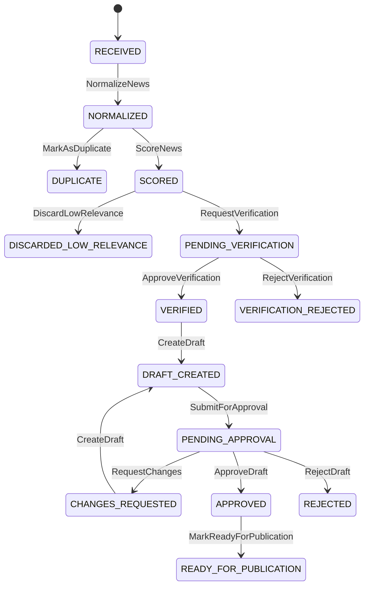

# Máquina de estados editorial — sistemandrestudio

## 1. Objetivo

A máquina representa, de forma local e determinística, o ciclo de vida de uma
notícia no MVP. Ela decide quais comandos são válidos, preserva versões, produz
eventos de auditoria e impede que conteúdo chegue a
`READY_FOR_PUBLICATION` sem verificação e aprovação humana.

O núcleo é puro: não usa rede, banco, Docker, variáveis de ambiente, relógio
real ou IDs aleatórios.

## 2. Estados

| Estado | Significado | Terminal |
| --- | --- | --- |
| `RECEIVED` | item fictício recebido, ainda não normalizado | não |
| `NORMALIZED` | título e URL canônica definidos | não |
| `DUPLICATE` | item vinculado a uma notícia canônica | sim |
| `SCORED` | relevância calculada por política versionada | não |
| `DISCARDED_LOW_RELEVANCE` | pontuação abaixo do limiar | sim |
| `PENDING_VERIFICATION` | item aguardando decisão factual | não |
| `VERIFIED` | evidências satisfazem a política | não |
| `VERIFICATION_REJECTED` | evidências rejeitam a informação | sim |
| `DRAFT_CREATED` | existe uma versão atual de rascunho | não |
| `PENDING_APPROVAL` | versão atual submetida ao humano | não |
| `CHANGES_REQUESTED` | humano pediu uma nova versão | não |
| `APPROVED` | humano aprovou a versão atual | não |
| `REJECTED` | humano rejeitou o rascunho | sim |
| `READY_FOR_PUBLICATION` | versão aprovada, sem publicar | sim |

## 3. Diagrama



## 4. Transições

| Origem | Comando | Destino | Regra principal |
| --- | --- | --- | --- |
| `RECEIVED` | `NormalizeNews` | `NORMALIZED` | título e URL canônica obrigatórios |
| `NORMALIZED` | `MarkAsDuplicate` | `DUPLICATE` | exige ID do item canônico |
| `NORMALIZED` | `ScoreNews` | `SCORED` | valor e limiar entre 0 e 100 |
| `SCORED` | `DiscardLowRelevance` | `DISCARDED_LOW_RELEVANCE` | valor abaixo do limiar |
| `SCORED` | `RequestVerification` | `PENDING_VERIFICATION` | valor igual ou acima do limiar |
| `PENDING_VERIFICATION` | `ApproveVerification` | `VERIFIED` | resultado `VERIFIED` |
| `PENDING_VERIFICATION` | `RejectVerification` | `VERIFICATION_REJECTED` | resultado `REJECTED` |
| `VERIFIED` | `CreateDraft` | `DRAFT_CREATED` | cria versão 1 |
| `DRAFT_CREATED` | `SubmitForApproval` | `PENDING_APPROVAL` | submete a versão atual |
| `PENDING_APPROVAL` | `RequestChanges` | `CHANGES_REQUESTED` | exige ator humano |
| `CHANGES_REQUESTED` | `CreateDraft` | `DRAFT_CREATED` | preserva anterior e cria próxima versão |
| `PENDING_APPROVAL` | `ApproveDraft` | `APPROVED` | versão atual, ator humano e chave idempotente |
| `PENDING_APPROVAL` | `RejectDraft` | `REJECTED` | versão atual, ator humano e motivo |
| `APPROVED` | `MarkReadyForPublication` | `READY_FOR_PUBLICATION` | aprovação corresponde à versão atual |

## 5. API de domínio

- `canTransition(currentState, targetState)`: consulta a topologia.
- `transition(entity, command, context)`: aplica um comando puro e retorna nova
  entidade, evento e indicador de replay.
- `validateEntity(entity)`: retorna violações estruturadas.
- `createReceivedNews(input)`: cria o estado inicial com dados fornecidos.
- `EditorialNewsRepository`: contrato substituível de persistência.
- `InMemoryEditorialNewsRepository`: adaptador para demo e testes unitários.
- `PostgresEditorialNewsRepository`: adaptador assíncrono de infraestrutura,
  implementado fora do domínio.

`TransitionContext` fornece `eventId`, ator e horário. Isso impede dependência
oculta de relógio ou gerador de UUID.

O contrato do repositório também consulta comandos processados. Essa capacidade
é usada pela camada de aplicação para idempotência entre agregados e após
reinício; não altera as regras de `transition()`.

## 6. Eventos

Cada transição efetiva acrescenta um `AuditEvent` com:

- ID;
- ID da notícia;
- estado anterior e novo;
- tipo do comando;
- ator e tipo do ator;
- timestamp;
- motivo opcional;
- versão de conteúdo relacionada;
- chave de idempotência quando houver.

Os tipos de ator aceitos pelo modelo são `SYSTEM`, `HUMAN`, `N8N`, `TELEGRAM` e
`LLM`. São representações locais; nenhuma integração é executada. Aprovação,
rejeição e pedido de alterações exigem ator `HUMAN`.

## 7. Invariantes

- transições fora da tabela são rejeitadas;
- duplicata e baixa relevância nunca geram rascunho;
- verificação rejeitada nunca segue para geração;
- rascunho só nasce após `VERIFIED`;
- somente a versão atual pode ser submetida ou aprovada;
- edição preserva versões e invalida a aprovação anterior;
- nova versão exige nova solicitação e nova decisão;
- somente uma decisão humana pode aprovar ou rejeitar;
- `READY_FOR_PUBLICATION` exige decisão de aprovação da versão atual;
- `READY_FOR_PUBLICATION` não publica conteúdo;
- IDs, atores e horários são dependências explícitas;
- a entidade e seus históricos são atualizados sem mutar a entrada.

## 8. Idempotência

Comandos que carregam `idempotencyKey` são registrados com:

- chave;
- tipo;
- fingerprint dos campos relevantes.

Um replay com a mesma chave e o mesmo fingerprint retorna a entidade sem
alteração e não cria novo evento. Reuso da chave com tipo ou payload diferente
gera `DUPLICATE_COMMAND`. IDs de eventos repetidos também são rejeitados.

No adaptador PostgreSQL, essa proteção também sobrevive ao processo por meio de
constraint única e gravação transacional em `processed_commands`.

## 9. Versionamento

`CreateDraft` acrescenta uma `DraftVersion` imutável:

- IDs são fornecidos pelo chamador;
- números começam em 1 e são sequenciais;
- `basedOnVersionId` liga a revisão à versão anterior;
- corpo, ator e horário ficam preservados.

`ApprovalRequest` sempre aponta para uma versão. Depois de
`CHANGES_REQUESTED`, a solicitação antiga permanece resolvida, uma nova versão é
criada e uma nova solicitação deve entrar em `PENDING_APPROVAL`.

## 10. Erros

Os erros derivam de `DomainError` e possuem códigos estáveis:

- `INVALID_TRANSITION`;
- `ENTITY_NOT_FOUND`;
- `DRAFT_VERSION_NOT_FOUND`;
- `APPROVAL_REQUEST_NOT_FOUND`;
- `APPROVAL_ALREADY_PROCESSED`;
- `DUPLICATE_COMMAND`;
- `REQUIRED_FIELD_MISSING`;
- `STALE_APPROVAL_VERSION`;
- `INVALID_RELEVANCE_SCORE`;
- `LOW_RELEVANCE`;
- `INVALID_ACTOR`.
- `CONCURRENT_UPDATE`.

## 11. Fixtures e exemplos

As fixtures usam nomes, URLs `.invalid`, IDs e timestamps fictícios:

| Cenário | Resultado |
| --- | --- |
| A — aprovado | `READY_FOR_PUBLICATION` |
| B — duplicado | `DUPLICATE` |
| C — baixa relevância | `DISCARDED_LOW_RELEVANCE` |
| D — verificação rejeitada | `VERIFICATION_REJECTED` |
| E — rascunho rejeitado | `REJECTED` |
| F — alteração solicitada | versão 2 exige aprovação nova |
| G — transição inválida | erro controlado |
| H — idempotência | segunda aprovação é replay sem evento |

Comandos locais:

```bash
npm run typecheck
npm run test
npm run build
npm run demo
```

## 12. Limitações do núcleo original

- o score e a verificação são entradas de fixture, não algoritmos completos;
- o adaptador em memória perde os dados ao encerrar o processo;
- o adaptador PostgreSQL fornece transação e concorrência otimista;
- a API interna posterior autentica o transporte, mas não substitui uma
  política completa de identidade e autorização;
- a orquestração posterior adiciona timeout e retry manual apenas para falhas
  transitórias;
- há radar RSS/Atom, templates n8n e canal Telegram opcional, mas não há LLM;
- não há publicação.

## 13. Evolução futura

1. ativar n8n e Telegram somente em ambiente autorizado;
2. ligar o pipeline operacional completo aos passos já persistidos;
3. ligar um adaptador de LLM somente ao comando `CreateDraft`;
4. manter a máquina independente de todas essas integrações;
5. preservar aprovação humana obrigatória antes de qualquer publicação.
# Etapa 10

O serviço de rascunho usa somente as transições já existentes:
`VERIFIED → DRAFT_CREATED → PENDING_APPROVAL`. `PARTIALLY_CONFIRMED` permanece
em `PENDING_VERIFICATION`; não há transição implícita, publicação ou aprovação
automática.
## Revisão humana

O estado físico legado `CHANGES_REQUESTED` corresponde semanticamente a `REVISION_REQUESTED`. Somente `PENDING_APPROVAL` aceita aprovação, rejeição ou solicitação de revisão; uma versão revisada volta obrigatoriamente por `DRAFT_CREATED` e `PENDING_APPROVAL`.

`APPROVED → READY_FOR_PUBLICATION` ocorre somente após exportação local
validada e manifesto persistido.

O plano de website não cria transição editorial. `READY_FOR_PUBLICATION`
permanece inalterado; `DRY_RUN_COMPLETED` pertence somente ao agregado do plano.

## Reconciliação externa

`READY_FOR_PUBLICATION → PUBLISHED` exige pacote de website íntegro, aprovação
da versão atual, origem `MANUAL_SUPERVISED_DEPLOY`, verificação pública
`VERIFIED` ou `VERIFIED_WITH_WARNINGS` e reconciliação `COMPLETED`.
`PUBLISHED` é terminal. A transição é persistida pelo adaptador transacional de
reconciliação e protegida também por constraints do PostgreSQL; não significa
que a máquina de estados executou o deploy.
## Estado da orquestração

A máquina da run é separada do agregado editorial:

```text
CREATED → RUNNING → WAITING_HUMAN_DECISION
WAITING_HUMAN_DECISION → COMPLETED | COMPLETED_WITH_WARNINGS
RUNNING → FAILED
estado não concluído → CANCELLED
```

O draft continua obedecendo à máquina editorial existente. A orquestração não
cria transições alternativas e não transforma timeout, LLM ou falha técnica em
aprovação.
